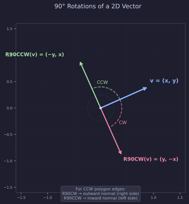
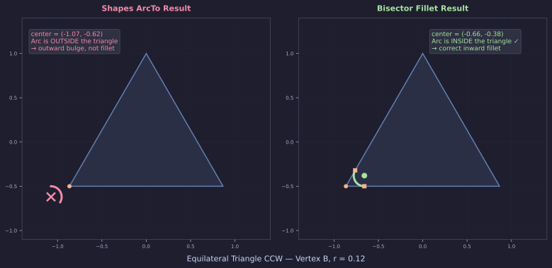
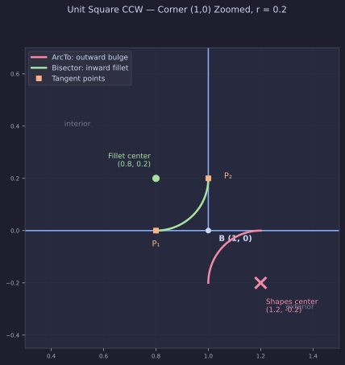
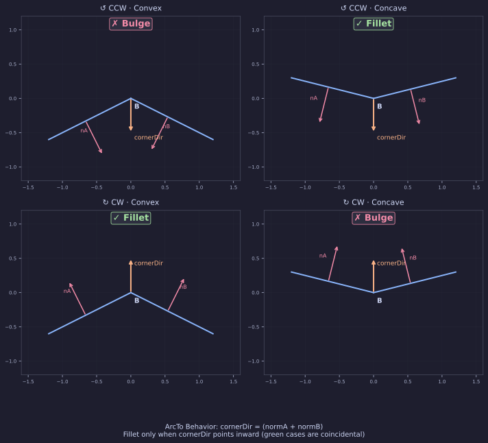
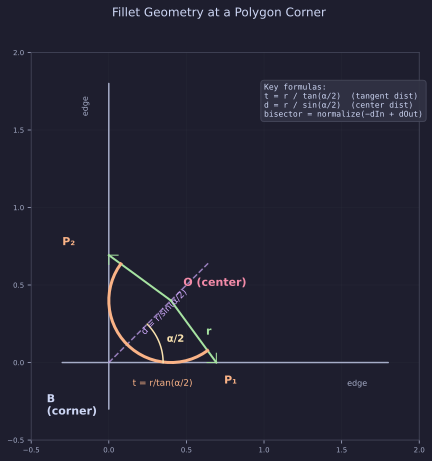

# 多边形圆角的数学原理

> **ShapesInteract 文档地图** · [README](../README.md) 总览 · [USAGE](../USAGE.md) 实操 · [RENDERING](../RENDERING.md) 渲染 · [IDRAW_INTERNALS](../IDRAW_INTERNALS.md) IDraw 原理 · **POLYGON_ROUNDING_MATH（本篇）** 多边形圆角数学

本文从**几何原理**出发，推导多边形圆角的完整数学过程。先讲 Shapes 库的原生 `ArcTo` 方案及其行为特征，再用代数证明揭示其局限，最后推导我们的 `PolygonRounding.BuildRoundedPath` 的角平分线算法。

相关源码：
- `Drawing/PolygonRounding.cs` —— 我们的圆角路径生成工具
- `Controls/IDrawOverloads.cs` —— `IDraw.Polygon` 圆角重载（调用 PolygonRounding）
- Shapes `PolygonPath.cs:80-113` —— 原生 `ArcTo` 实现
- Shapes `ShapesMath.cs` —— `Rotate90CW`、`GetArcPoints` 辅助方法

---

## §1 前置数学知识

### 1.1 向量单位化

对任意二维向量 $\vec{v} = (x, y)$，其长度 $|\vec{v}| = \sqrt{x^2 + y^2}$。单位化得到同方向的单位向量：

$$\hat{v} = \frac{\vec{v}}{|\vec{v}|}$$

单位向量纯粹表示**方向**，不带长度信息。圆角算法中反复使用单位向量，是为了分离"方向"和"距离"两个因素——方向决定切点和圆心在哪一侧，距离由圆角半径 $r$ 单独控制。

### 1.2 点积与夹角

两个向量 $\vec{a}$、$\vec{b}$ 的点积：

$$\vec{a} \cdot \vec{b} = |\vec{a}| \cdot |\vec{b}| \cdot \cos\theta = a_x b_x + a_y b_y$$

当 $\vec{a}$、$\vec{b}$ 都是单位向量时，点积直接等于 $\cos\theta$（$\theta$ 为两向量夹角）：

$$\theta = \arccos(\vec{a} \cdot \vec{b}) \quad \text{当} \; |\vec{a}| = |\vec{b}| = 1$$

### 1.3 二维叉积与旋转方向

二维向量的标量叉积：

$$\vec{a} \times \vec{b} = a_x b_y - a_y b_x$$

这个值的**符号**有明确的几何含义：

- **$\vec{a} \times \vec{b} > 0$**：从 $\vec{a}$ 到 $\vec{b}$ 是**逆时针**旋转（$\vec{b}$ 在 $\vec{a}$ 的左侧）
- **$\vec{a} \times \vec{b} < 0$**：从 $\vec{a}$ 到 $\vec{b}$ 是**顺时针**旋转（$\vec{b}$ 在 $\vec{a}$ 的右侧）
- **$\vec{a} \times \vec{b} = 0$**：两向量共线

### 1.4 Rotate90CW 与 Rotate90CCW

<p align="center">
  
</p>

将向量 $(x, y)$ 旋转 90° 有两个方向：

$$\text{Rotate90CW}(x, y) = (y, -x) \quad \text{顺时针 90°}$$
$$\text{Rotate90CCW}(x, y) = (-y, x) \quad \text{逆时针 90°}$$

几何含义：如果原向量沿某条边的方向，则：

- **Rotate90CW** 得到的向量指向边的**右侧**
- **Rotate90CCW** 得到的向量指向边的**左侧**

对于一个**逆时针缠绕**的多边形，沿边界行走时，内部在**左侧**。因此：

- Rotate90CW → 右法线 → **外侧法线**
- Rotate90CCW → 左法线 → **内侧法线**

Shapes 的 `ArcTo` 使用 `Rotate90CW(tangent)` 得到外法线。`ShapesMath.Rotate90CW` 的实现（`ShapesMath.cs`）：

```csharp
public static Vector2 Rotate90CW(Vector2 v) => new Vector2(v.y, -v.x);
```

### 1.5 两个单位向量的和与角平分线

若 $\vec{u}_1$ 和 $\vec{u}_2$ 都是单位向量，则它们的和 $\vec{u}_1 + \vec{u}_2$ 的方向恰好是两者的**角平分线**方向。

证明：将 $\vec{u}_1$ 和 $\vec{u}_2$ 视为一个菱形的两条边。菱形的对角线 $\vec{u}_1 + \vec{u}_2$ 平分两边的夹角。

这一性质在圆角算法中反复使用——法线的和得到法线角平分线，方向的反向之和得到方向角平分线。

---

## §2 Shapes 的 PolygonPath 数据结构

### 2.1 本质：有序点列表

`PolygonPath` 继承 `PointPath<Vector2>`（Shapes 源码 `PointPath.cs`），核心数据结构是：

```csharp
protected List<T> path = new List<T>();
```

**就是一个 `List<Vector2>`**——一组有序的二维坐标点。没有任何"弧线段"或"贝塞尔段"的类型标记。

### 2.2 AddPoint 与 ArcTo 的区别

- `AddPoint(v)`：直接追加一个点
- `ArcTo(corner, next, radius)`：追加**一组点**——用足够多的直线段去**逼近**一段圆弧

"圆角"的本质是：在拐角处，用**多个采样点描绘一段圆弧**，替换掉原来的单个尖角顶点。由于采样点足够密，渲染后看起来是光滑的圆角。

### 2.3 从路径到像素：EarClipping 三角剖分

`Draw.Polygon(path)` 的渲染流程：

1. Shapes 对 path 中的所有点做 **EarClipping 三角剖分**——将任意简单多边形分解为若干不重叠的三角形
2. 三角形送入 Mesh → GPU 渲染

**关键约束**：EarClipping 要求多边形是**简单的（non-self-intersecting）**。如果路径自相交，三角剖分会失败。

---

## §3 Shapes ArcTo 的数学原理

以下是 Shapes `PolygonPath.cs:80-113` 的算法步骤：

### 3.1 输入

- `LastPoint`：路径中已添加的**上一个点**（入边起点）
- `corner`：当前拐角顶点
- `next`：下一个点（出边终点）
- `radius`：圆角半径 $r$

### 3.2 步骤一：计算边的切线方向

$$\text{tangentA} = \frac{\text{corner} - \text{LastPoint}}{|\text{corner} - \text{LastPoint}|} \quad \text{入边方向}$$

$$\text{tangentB} = \frac{\text{next} - \text{corner}}{|\text{next} - \text{corner}|} \quad \text{出边方向}$$

### 3.3 步骤二：计算边的法线

$$\text{normA} = \text{Rotate90CW}(\text{tangentA}) = (\text{tangentA}_y, -\text{tangentA}_x)$$

$$\text{normB} = \text{Rotate90CW}(\text{tangentB}) = (\text{tangentB}_y, -\text{tangentB}_x)$$

由 §1.4 可知，对 CCW 多边形，这是**外法线**。

### 3.4 步骤三：法线角平分线与圆心

$$\text{cornerDir} = \frac{\text{normA} + \text{normB}}{|\text{normA} + \text{normB}|} \quad \text{法线角平分线}$$

$$\text{cornerBDot} = \text{cornerDir} \cdot \text{normB} = \cos\frac{\varphi}{2}$$

其中 $\varphi$ 是 normA 与 normB 的夹角。

$$\text{center} = \text{corner} + \text{cornerDir} \times \frac{r}{\cos(\varphi/2)}$$

**推导**：center 到 corner 的距离为 $d$，center 到任一边法线方向的投影应等于 $r$：

$$d \cdot \cos\frac{\varphi}{2} = r \implies d = \frac{r}{\cos(\varphi/2)}$$

### 3.5 步骤四：生成弧线采样点

```csharp
AddPoints(ShapesMath.GetArcPoints(-normA, -normB, center, radius, count));
```

从 $-\text{normA}$ 到 $-\text{normB}$ 用 Slerp 插值，每个采样点：

$$\text{point}_j = \text{center} + \text{direction}_j \times r$$

---

## §4 ArcTo 的实际行为——路径弧线插入，非 fillet

理解 ArcTo 的关键在于：**ArcTo 不是为填充多边形的内切圆角设计的**。

### 4.1 ArcTo 的设计意图

Shapes 的 `ArcTo` 是一个**低层路径构建原语**，用于在路径的拐角处插入一段弧线采样点。它的注释原文是：

> *"Adds points of an arc wedged into the corner"*

关键词是 "wedged **into** the corner"——从拐角的外侧嵌入一段弧。这不是一个 fillet 操作（从内侧削去尖角），而是一个**路径装饰操作**（在拐角处添加弧线）。

支持这一判断的证据：
- `PolygonPath` 和 `PolylinePath` **都有相同的 ArcTo 算法**（`PolylinePath.cs:257-299` 用 `Vector3.Cross` 替代 `Rotate90CW`，但数学结构一致）
- Polylines 的 **Round joins** 使用完全不同的机制（`ShapesMeshGen.cs` 中的单独 join mesh + shader），**不调用 ArcTo**
- Shapes 的官方 **Samples 中没有任何 ArcTo 的使用示例**
- Shapes 的官方文档中也没有 ArcTo 的详细说明

**结论**：ArcTo 是一个通用的路径弧线插入工具。Shapes 库本身**没有为任意填充多边形提供内建的 fillet 能力**——这正是我们需要 `PolygonRounding.BuildRoundedPath` 的原因。

### 4.2 对 CCW 凸角：圆心在外侧

ArcTo 对 CCW 多边形的凸角，normA 和 normB 都指向**外侧**（§1.4）。cornerDir = (normA + normB) 也指向**外侧**。因此：

$$\text{center} = \text{corner} + \underbrace{\text{cornerDir}}_{\text{外侧}} \times d \implies \text{center 在外侧}$$

ArcTo 生成的弧线向外凸起。如果我们的目标是 **fillet**（弧线向内凹陷，削去尖角），那么这个行为不满足需求。

### 4.3 数值验证：正三角形

<p align="center">
  
</p>

取 CCW 正三角形，顶点 $A(0, 1)$、$B(-\frac{\sqrt{3}}{2}, -\frac{1}{2})$、$C(\frac{\sqrt{3}}{2}, -\frac{1}{2})$，$r = 0.12$。

在顶点 $B$ 处：

| 量 | 值 |
|---|---|
| dIn = normalize(B − A) | $(−0.5, −0.866)$ |
| dOut = normalize(C − B) | $(1, 0)$ |
| normA = Rotate90CW(dIn) | $(−0.866, 0.5)$ — 外法线 ✓ |
| normB = Rotate90CW(dOut) | $(0, −1)$ — 外法线 ✓ |
| cornerDir | $(−0.866, −0.5)$ — **朝外** |
| **Shapes center** | **$(−0.866 − 0.173, −0.5 − 0.15) = (−1.039, −0.65)$** — **三角形外部** ⛔ |

对比正确 fillet（我们的 bisector 方法）：

| 量 | 值 |
|---|---|
| bisector = normalize(−dIn + dOut) | $(0.866, 0.5)$ — **朝内** |
| **正确 center** | **$(−0.866 + 0.173, −0.5 + 0.15) = (−0.693, −0.4)$** — **三角形内部** ✓ |

Shapes ArcTo 的圆心在 $(-1.039, -0.65)$，完全在三角形**外部**，产生的弧线是外凸弧。

### 4.3 数值验证：正方形角

<p align="center">
  
</p>

单位正方形 CCW，角 $(1, 0)$，$r = 0.2$：

| | Shapes ArcTo | 正确 fillet |
|---|---|---|
| **center** | $(1.2, -0.2)$ ⛔ 外部 | $(0.8, 0.2)$ ✓ 内部 |
| **弧起点** | $(1.2, 0)$ — 边的延长线上 | $(0.8, 0)$ — 在边上 ✓ |
| **弧终点** | $(1, -0.2)$ — 边的延长线上 | $(1, 0.2)$ — 在边上 ✓ |

两套圆心是关于角点 $(1,0)$ 的**镜像对称**。

---

## §5 代数证明：cornerDir ≡ −bisector（恒等）

### 5.1 核心等式

Shapes 的 cornerDir 和我们的 bisector 之间的关系可以用纯代数证明。

$$\text{cornerDir} \propto \text{normA} + \text{normB} = \text{Rotate90CW}(\text{dIn}) + \text{Rotate90CW}(\text{dOut})$$

因为 Rotate90CW 是线性运算：

$$\text{Rotate90CW}(\text{dIn}) + \text{Rotate90CW}(\text{dOut}) = \text{Rotate90CW}(\text{dIn} + \text{dOut})$$

我们的 bisector：

$$\text{bisector} \propto -\text{dIn} + \text{dOut}$$

要证 $\text{Rotate90CW}(\text{dIn} + \text{dOut}) \propto -(-\text{dIn} + \text{dOut}) = \text{dIn} - \text{dOut}$，即：

$$\text{Rotate90CW}(\text{dIn} + \text{dOut}) \propto \text{dIn} - \text{dOut}$$

展开验证：

$$\text{Rotate90CW}(\text{dIn} + \text{dOut}) = (\text{dIn}_y + \text{dOut}_y, -\text{dIn}_x - \text{dOut}_x)$$

$$\text{dIn} - \text{dOut} = (\text{dIn}_x - \text{dOut}_x, \text{dIn}_y - \text{dOut}_y)$$

这两个向量成比例，当且仅当交叉乘积为零：

$$(\text{dIn}_y + \text{dOut}_y)(\text{dIn}_y - \text{dOut}_y) = -(\text{dIn}_x + \text{dOut}_x)(\text{dIn}_x - \text{dOut}_x)$$

$$\text{dIn}_y^2 - \text{dOut}_y^2 = -\text{dIn}_x^2 + \text{dOut}_x^2$$

$$\text{dIn}_x^2 + \text{dIn}_y^2 = \text{dOut}_x^2 + \text{dOut}_y^2$$

因为 dIn 和 dOut 都是**单位向量**，两边都等于 1。**QED。**

### 5.2 结论

$$\boxed{\text{cornerDir} \propto -\text{bisector} \quad \text{恒成立}}$$

Shapes 的 cornerDir **永远指向**我们 bisector 的**反方向**。这对所有顶点（无论凸/凹、CCW/CW）都成立。

### 5.3 缠绕依赖表

<p align="center">
  
</p>

Shapes ArcTo 的实际行为取决于缠绕方向和角的凸凹性：

| 缠绕 | 角类型 | 法线方向 | cornerDir | 圆心位置 | 结果 |
|------|--------|----------|-----------|----------|------|
| CCW | 凸角 | 外法线 | 外侧 | **外侧** | **外凸弧**（非 fillet） |
| CCW | 凹角 | 外法线 | 内侧 | **内侧** | **效果等同于 fillet** ✓ |
| CW | 凸角 | 内法线 | 内侧 | **内侧** | **效果等同于 fillet** ✓ |
| CW | 凹角 | 内法线 | 外侧 | **外侧** | **外凸弧**（非 fillet） |

ArcTo 在 CW 凸角和 CCW 凹角上效果等同于 fillet，这是法线方向在这种组合下恰好指向内侧的结果——但 ArcTo 本身不区分这些情况，也不保证 fillet 语义。

### 5.4 Shapes 的 RegularPolygon roundness 为什么无关

Shapes 的 `Draw.RegularPolygon(center, sides, radius, angle, roundness, color)` 走**完全不同的技术路线**：

- `roundness` 参数被传入 `MaterialPropertyBlock`，由 **GPU shader** 在片段着色器中计算圆角
- 它**不经过** `PolygonPath`，也**不调用** `ArcTo`
- 只适用于正多边形（正 $n$ 边形），不支持任意多边形
- 参数是归一化值 $[0, 1]$，不是绝对世界单位

因此 RegularPolygon roundness 的圆角能力和本文讨论的 `PolygonPath.ArcTo` / `PolygonRounding.BuildRoundedPath` 是**完全不同的技术栈**。

---

## §6 角平分线方案——PolygonRounding.BuildRoundedPath

### 6.1 设计目标

我们需要一个对**任意简单多边形**（含凸角和凹角）都能正确生成 fillet 圆角路径的方法，且不依赖于缠绕方向。

### 6.2 约定

对于多边形的第 $i$ 个顶点 $B$，其前后相邻顶点为 $A$（前一个）和 $C$（后一个）：

$$\text{dIn} = \frac{B - A}{|B - A|} \quad \text{沿入边，从 A 指向 B}$$

$$\text{dOut} = \frac{C - B}{|C - B|} \quad \text{沿出边，从 B 指向 C}$$

注意：**dIn 指向 B**（沿入边靠近 B），**dOut 离开 B**（沿出边远离 B）。

### 6.3 步骤一：计算两边夹角 α

$$\cos\alpha = -\text{dIn} \cdot \text{dOut}, \quad \alpha = \arccos(\cos\alpha)$$

**为什么有负号？** dIn 指向 B，dOut 离开 B，它们的夹角是 $\pi - \alpha$（补角）。取负号还原为两边的实际夹角 $\alpha \in (0, \pi)$。

极端情况验证：
- 两边共线同向：$\text{dIn} \cdot \text{dOut} = 1 \Rightarrow \cos\alpha = -1 \Rightarrow \alpha = \pi$（平直，不圆角）
- 两边反向折叠：$\text{dIn} \cdot \text{dOut} = -1 \Rightarrow \cos\alpha = 1 \Rightarrow \alpha = 0$（退化）
- 两边成 90°：$\text{dIn} \cdot \text{dOut} = 0 \Rightarrow \cos\alpha = 0 \Rightarrow \alpha = \pi/2$ ✓

### 6.4 步骤二：切点距离

<p align="center">
  
</p>

$$t = \frac{r}{\tan(\alpha/2)}$$

**几何推导**：圆角的圆心到切点的连线垂直于边。在顶点 $B$、切点 $P_1$、圆心 $O$ 构成的直角三角形中：

- $\angle OBP_1 = \alpha/2$（圆心在角平分线上，切点对称）
- 对边 $= r$，邻边 $= t$
- $\tan(\alpha/2) = r / t \Rightarrow t = r / \tan(\alpha/2)$

切点位置：

$$P_1 = B - \text{dIn} \times t \quad \text{入边上的切点}$$

$$P_2 = B + \text{dOut} \times t \quad \text{出边上的切点}$$

### 6.5 步骤三：角平分线方向——核心洞察

$$\text{bisector} = \frac{-\text{dIn} + \text{dOut}}{|-\text{dIn} + \text{dOut}|}$$

**为什么这个方向对凸角和凹角都正确？**

先理解 $(-\text{dIn} + \text{dOut})$ 的几何含义：

- $-\text{dIn}$：入边的反方向，从 $B$ 指回 $A$（即沿入边向内）
- $\text{dOut}$：出边方向，从 $B$ 指向 $C$（沿出边向外）
- 两者之和的几何效果：沿角的外侧张开的平分线方向

由 §5.2 的代数证明，`bisector = -cornerDir`。而 cornerDir 对 CCW 凸角指向外侧（§4.1），所以 bisector 对 CCW 凸角指向**内侧**——恰好是 fillet 圆心应该所在的一侧。

**凸角**（如正方形的角）：
- bisector 指向角张开的"外侧"方向
- 对于 CCW 多边形，角的"外侧" = 多边形的外侧
- 圆心在角的外侧空间 → 弧线从外侧削去尖角 ✓

**凹角**（如五角星的内顶点）：
- bisector 仍然指向角张开的"外侧"
- 但凹角的"外侧"是朝向多边形**外部**的空间
- 圆心在多边形外部 → 弧线从外部平滑内凹 ✓

**关键**：bisector 的方向由两边的几何关系唯一确定，不依赖于多边形的缠绕方向或凸凹分类。

### 6.6 步骤四：圆心位置

$$\text{center} = B + \text{bisector} \times \frac{r}{\sin(\alpha/2)}$$

**推导**：在 $B$、$P_1$、$O$ 的直角三角形中：

$$|BO| = d, \quad \angle OBP_1 = \frac{\alpha}{2}, \quad \sin\frac{\alpha}{2} = \frac{r}{d}$$

$$d = \frac{r}{\sin(\alpha/2)}$$

### 6.7 步骤五：弧线生成——角度扫描

$$\theta_\text{start} = \text{atan2}(P_{1y} - O_y, P_{1x} - O_x)$$

$$\theta_\text{end} = \text{atan2}(P_{2y} - O_y, P_{2x} - O_x)$$

$$\text{sweep} = \theta_\text{end} - \theta_\text{start}$$

对 sweep 做 $[-\pi, \pi]$ 归一化（保证最短弧），然后均匀采样：

$$\text{point}_j = O + \begin{pmatrix} \cos\theta_j \\ \sin\theta_j \end{pmatrix} \times r, \quad \theta_j = \theta_\text{start} + \text{sweep} \times \frac{j}{n-1}$$

**为什么用 atan2 扫描而不是 Slerp？**

Shapes 的 `GetArcPoints` 使用 `Vector3.Slerp`，它总是走两个方向之间的**最短路径**。但在某些多边形构型中，弧线需要走**长路径**（大弧），Slerp 会错误地选择反方向的短弧。

`atan2` + 带符号的 sweep 保留了绕行方向，保证弧线与多边形缠绕一致。

### 6.8 安全钳制

$$t_\text{max} = \min(|B - A|, |C - B|) \times 0.49$$

$$\text{if } t > t_\text{max}: \quad t = t_\text{max}, \quad r = t \times \tan\frac{\alpha}{2}$$

当边很短或圆角半径很大时，切点可能落在边之外。钳制到半边长的 49%，确保相邻角的弧线不会重叠。此时实际圆角半径 $r$ 自动缩小。

---

## §7 完整流程与应用

### 7.1 从顶点到圆角多边形

以五角星为例，`GetStarVertices(center, outerR, innerRatio)` 生成 10 个顶点：

```
for i in 0..9:
    angle = startAngle + i × (2π / 10)
    r = (i 为偶数) ? outerR : outerR × innerRatio
    vertex[i] = center + (cos(angle), sin(angle)) × r
```

5 个外顶点（角尖）半径大，5 个内顶点（凹角）半径小。这些点**只记录坐标**，不含任何圆角信息。

`PolygonRounding.BuildRoundedPath(vertices, roundRadius)` 处理每个顶点，将其替换为弧线采样点。

### 7.2 不同顶点的弧线形状自动不同

虽然所有顶点使用**同一个** roundRadius，但由于各顶点的夹角 $\alpha$ 不同：

- **外顶点（角尖）**：$\alpha$ 较小（尖角）→ $t$ 较小 → 弧线短而急 → 圆角紧贴角尖
- **内顶点（凹角）**：$\alpha$ 较大（钝角）→ $t$ 较大 → 弧线长而缓 → 圆角平滑内收

这是**自然发生的**，不需要对每个顶点指定不同的半径。

### 7.3 使用方式

**可交互图形**（通过 IDraw）：

```csharp
IDraw.Polygon("star", vertices, roundRadius, color);
// 内部调用 PolygonRounding.BuildRoundedPath
```

**纯视觉图形**（直接用 Shapes Draw + PolygonRounding）：

```csharp
using (var path = PolygonRounding.BuildRoundedPath(vertices, roundRadius))
    Draw.Polygon(path, color);
```

命中检测仍使用**原始顶点**（不含圆角），因为圆角通常很小，命中区差异可忽略。

### 7.4 程序集位置

`PolygonRounding` 位于 `UnityDemo.Shared.ShapesInteract.Drawing` 程序集，仅依赖 `ShapesRuntime`，不依赖 ShapesInteract 交互层。因此：

- **需要交互**的 Demo 引用 `Controls`（自动传递 `Drawing`）
- **只需绘制圆角**（不需交互）的 Demo 可单独引用 `Drawing`

---

## §8 总结对比

| 问题 | Shapes 原生 ArcTo | PolygonRounding.BuildRoundedPath |
|------|------------------|----------------------------------|
| **设计意图** | 通用路径弧线插入（非 fillet 专用） | 填充多边形的内切圆角（fillet） |
| **CCW 凸角** | 外凸弧（center 在外侧） | 正确 fillet ✓ |
| **CCW 凹角** | 效果等同于 fillet ✓ | 正确 fillet ✓ |
| **CW 凸角** | 效果等同于 fillet ✓ | 正确 fillet ✓ |
| **CW 凹角** | 外凸弧 | 正确 fillet ✓ |
| **弧线方向** | Slerp 可能选错绕行方向 | atan2 角度扫描，方向始终正确 |
| **API 便捷度** | 需手动逐角调用 ArcTo | 一行 `BuildRoundedPath(verts, r)` |
| **缠绕依赖** | 结果随缠绕方向变化 | 不依赖缠绕方向 |

**设计决策**：Shapes 的 ArcTo 是一个设计意图明确的路径构建原语，**不是 bug**。但它的语义是"在拐角外侧嵌入弧线"，不满足"对任意填充多边形做内切圆角"的需求。我们选择**不改 Shapes 源码**（它是 vendored 第三方库），而是在独立程序集中自建 `PolygonRounding`，提供 Shapes 缺失的 fillet 能力。

---

## 附录：关键公式速查

| 量 | 公式 | 含义 |
|----|------|------|
| 两边夹角 | $\alpha = \arccos(-\text{dIn} \cdot \text{dOut})$ | dIn、dOut 的补角 |
| 切点距离 | $t = r / \tan(\alpha/2)$ | 顶点到切点的直线距离 |
| 角平分线 | $\text{bisector} = \text{normalize}(-\text{dIn} + \text{dOut})$ | 始终指向圆心正确一侧 |
| 圆心距 | $d = r / \sin(\alpha/2)$ | 顶点到圆心的距离 |
| 圆心位置 | $\text{center} = B + \text{bisector} \times d$ | |
| 切点 P₁ | $P_1 = B - \text{dIn} \times t$ | 入边上的切点 |
| 切点 P₂ | $P_2 = B + \text{dOut} \times t$ | 出边上的切点 |
| 恒等式 | $\text{cornerDir} = -\text{bisector}$ | Shapes ArcTo 的 cornerDir 永远与我们相反 |
